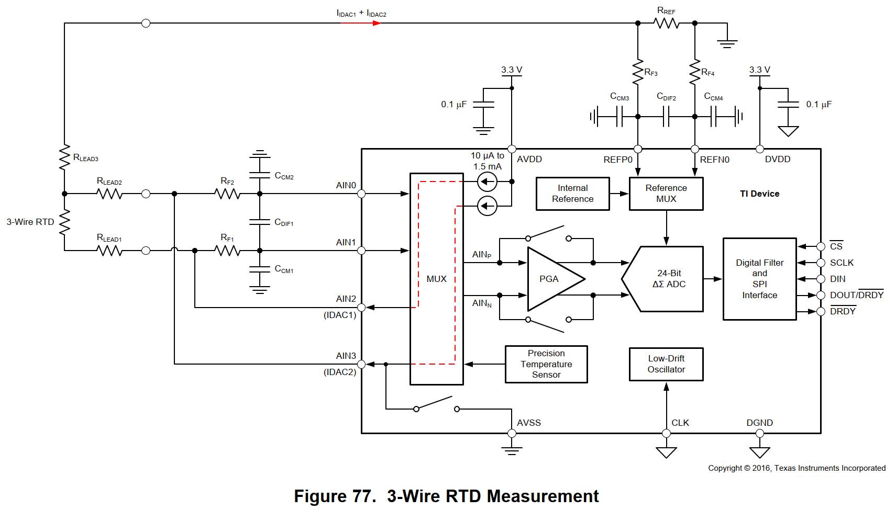

# ADS1220

Arduino library for [ADS1220](https://www.ti.com/product/ADS1220) 24-bit, 2-kSPS, four-channel, low-power, delta-sigma ADC with PGA, VREF, SPI and two IDACs

## Circuit Design for Examples

The configurations for the example codes are based on the circuit "Figure 77. 3-Wire RTD Measurement" shown in the [ADS1220 data sheet](https://www.ti.com/jp/lit/ds/symlink/ads1220.pdf).



If you want to use your own circuit and configurations, I recommend to read the following data sheet and application note first.

- [ADS1220 Data Sheet](https://www.ti.com/jp/lit/ds/symlink/ads1220.pdf)
- [TI Application Node: A Basic Guide to RTD Measurements](https://www.ti.com/lit/an/sbaa275a/sbaa275a.pdf)

## Usage

```c++
#include <ADS1220.hpp>

ads1220::ADS1220 ads;
static constexpr uint8_t PIN_CS = SS;
static constexpr uint8_t PIN_DRDY = 2;
static constexpr float R_REF_OHMS = 2400;

void setup()
{
    Serial.begin(115200);
    while (!Serial);
    delay(5000);
    Serial.println("Start ADS1220");

    SPI.begin();
    SPISettings spi_settings(1000000, MSBFIRST, SPI_MODE1);
    ads.begin(SPI, PIN_CS, PIN_DRDY, spi_settings);

    using namespace ads1220::config;
    ads.write_config_pga_bypass(pga_bypass::ENABLE);
    ads.write_config_pga_gain(gain::GAIN_1);
    ads.write_config_input_multiplexer(mux::AIN1_AIN0);
    ads.write_config_burn_out_current_sources(burn_out_current_sources::OFF);
    ads.write_config_temperature_sensor(temperature_sensor::DISABLE);
    ads.write_config_conversion_mode(conversion_mode::SINGLE_SHOT);
    ads.write_config_operating_mode(mode::NORMAL);
    ads.write_config_data_rate_normal(data_rate::NORMAL_600_SPS);
    ads.write_config_idac_current(idac::IDAC_250_UA);
    ads.write_config_low_side_power_switch(low_side_power_switch::ALWAYS_OPEN);
    ads.write_config_fir_filter(fir_50_60::FIR_OFF);
    ads.write_config_vref_selection(vref::EXTERNAL_REFP0_REFN0);
    ads.write_config_drdy_mode(drdy_mode::DRDY_ONLY);
    ads.write_config_idac2_routing(i2mux::AIN3);
    ads.write_config_idac1_routing(i1mux::AIN2);

    ads.print_config_registers();
}

void loop()
{
    int32_t data = ads.read();
    Serial.print("Read data: 0x");
    Serial.println(data, HEX);

    float gain = ads.get_config_pga_gain_value();
    float r_rtd = ads1220::get_three_wired_rtd_ohms_low_side_ref_from_read_data(R_REF_OHMS, gain, data);
    Serial.print("R_RTD: ");
    Serial.print(r_rtd);
    Serial.println(" [ohms]");

    float temperature = ads1220::get_temperature_from_rtd_ohms_with_linear_approx(r_rtd);
    Serial.print("Approx temperature: ");
    Serial.print(temperature);
    Serial.println(" [deg C]\n");

    delay(1000);
}
```

## APIs

```c++
/// @brief Initialize ADS1220 with CS/DRDY pins
void begin(SPIClass &spi, uint8_t pin_cs, uint8_t pin_drdy, const SPISettings &spi_settings);
/// @brief Initialize ADS1220 with CS/DRDY user-defined functions
void begin(SPIClass &spi, std::function<void(uint8_t)> fn_cs, std::function<int(void)> fn_drdy, const SPISettings &spi_settings);

// ==================== Read ADC Data ====================
/// @brief Read 24-bit twos complement ADC data as int32_t with timeout
int32_t read(uint32_t timeout_ms = 60);

// ==================== Single-Ended Input Selection ====================
/// @brief Select single-ended input by writing register MUX
void select_single_ended_input(config::mux::SingleEnded value)

// ==================== Begin/End Continuous Conversion ====================
/// @brief Begin continuous conversion mode
void begin_continuous();
/// @brief End continuous conversion mode
void end_continuous();
/// @brief Check if continuous conversion mode is enabled
bool is_continuous_conversion_mode() const;
/// @brief Check if continuous conversion is in progress
bool is_continuous_converting() const;

// ==================== Internal Temperature Sensor ====================
/// @brief Begin internal temperature sensor mode
void begin_internal_temperature_sensor_mode();
/// @brief Read 14-bit twos complement internal temperature sensor data and convert to temperature in deg C
float read_internal_temperature(uint32_t timeout_ms = 60);
/// @brief End internal temperature sensor mode
void end_internal_temperature_sensor_mode();
/// @brief Check if internal temperature sensor mode is enabled
bool is_internal_temperature_sensor_mode() const;

// ==================== Command ====================
/// @brief Send RESET command
bool reset();
/// @brief Send START/SYNC command
void start_sync();
/// @brief Send POWERDOWN command
void power_down()
/// @brief Send RDATA command
uint32_t rdata();
/// @brief Send WREG command
void wreg(uint8_t address, const uint8_t *tx_data, size_t size);
/// @brief Send RREG command
void rreg(uint8_t address, uint8_t *rx_data, size_t size);

// ==================== Read/Write Configuration Registers ====================
/// @brief Write a value to the register
void write_register(uint8_t address, uint8_t value);
/// @brief Write values to the registers
void write_registers(uint8_t address, const uint8_t *tx_data, size_t size);
/// @brief Read a value from the register
uint8_t read_register(uint8_t address);
/// @brief Read values from the registers
void read_registers(uint8_t address, uint8_t *rx_data, size_t size);
/// @brief Read all configuration registers into the internal buffer
const uint8_t *read_config_registers();
/// @brief Print configuration register values to Serial
void print_config_registers();

// ===== control register 0 =====
void write_config_pga_bypass(config::pga_bypass::PgaBypass value);
void write_config_pga_gain(config::gain::Gain value);
void write_config_input_multiplexer(config::mux::Mux value);
uint8_t get_config_pga_bypass() const;
uint8_t get_config_pga_gain() const;
uint8_t get_config_pga_gain_value() const;
uint8_t get_config_input_multiplexer() const;

// ===== control register 1 =====
void write_config_burn_out_current_sources(config::burn_out_current_sources::Bcs value);
void write_config_temperature_sensor(config::temperature_sensor::Ts value);
void write_config_conversion_mode(config::conversion_mode::Cm value);
void write_config_operating_mode(config::mode::Mode value);
void write_config_data_rate_normal(config::data_rate::DrNormal value);
void write_config_data_rate_duty_cycle(config::data_rate::DrDutyCycle value);
void write_config_data_rate_turbo(config::data_rate::DrTurbo value);
uint8_t get_config_burn_out_current_sources() const;
uint8_t get_config_temperature_sensor() const;
uint8_t get_config_conversion_mode() const;
uint8_t get_config_operation_mode() const;
uint8_t get_config_data_rate() const;

// ===== control register 2 =====
void write_config_idac_current(config::idac::Idac value);
void write_config_low_side_power_switch(config::low_side_power_switch::Psw value);
void write_config_fir_filter(config::fir_50_60::Fir5060 value);
void write_config_vref_selection(config::vref::Vref value);
uint8_t get_config_idac_current() const;
uint8_t get_config_low_side_power_switch() const;
uint8_t get_config_fir_filter() const;
uint8_t get_config_vref_selection() const;

// ===== control register 3 =====
void write_config_drdy_mode(config::drdy_mode::DrdyMode value);
void write_config_idac2_routing(config::i2mux::I2Mux value);
void write_config_idac1_routing(config::i1mux::I1Mux value);
uint8_t get_config_drdy_mode() const;
uint8_t get_config_idac2_routing() const;
uint8_t get_config_idac1_routing() const;
```

### RTD Measurements related Utilities

```c++
/// @brief Calcurate 2-wired RTD resistance from read data
inline constexpr float get_two_wired_rtd_ohms_from_read_data(float r_ref_ohms, float gain, int32_t data);
/// @brief Calcurate 3-wired RTD resistance (with Low-Side Reference) from read data
inline constexpr float get_three_wired_rtd_ohms_low_side_ref_from_read_data(float r_ref_ohms, float gain, int32_t data);
/// @brief Calcurate 3-wired RTD resistance (generic) from read data
inline constexpr float get_three_wired_rtd_ohms_from_read_data(float r_ref_ohms, float gain, int32_t data1, int32_t data2);
/// @brief Calcurate 3-wired RTD resistance (with High-Side Reference) from read data
inline constexpr float get_three_wired_rtd_ohms_high_side_ref_from_read_data(float r_ref_ohms, float gain, int32_t data);
/// @brief Calcurate 4-wired RTD resistance from read data
inline constexpr float get_four_wired_rtd_ohms_from_read_data(float r_ref_ohms, float gain, int32_t data);
/// @brief Calcurate linear approximation of temperature from RTD resistance (PT100)
inline constexpr float get_temperature_from_rtd_ohms_with_linear_approx(float r_rtd_ohms);
```

## Reference

- [ADS1220 Data Sheet](https://www.ti.com/jp/lit/ds/symlink/ads1220.pdf)
- [TI Application Node: A Basic Guide to RTD Measurements](https://www.ti.com/lit/an/sbaa275a/sbaa275a.pdf)

## License

MIT
